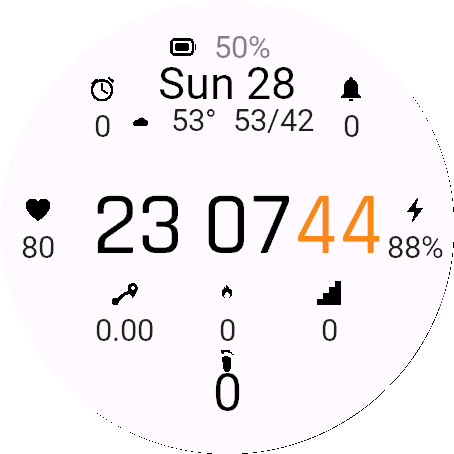

# Penumbra

A bright, data-dense digital watch face for Garmin Connect IQ. Three large digit
groups show **HH MM SS** (accent-coloured seconds), ringed by a full set of icon
complications. Ships with **Light** and **Dark** themes and a selectable accent
colour — _penumbra_, the boundary between light and shadow.



## Features

- **Big flip-style time** — hours/minutes in the theme ink colour, seconds a tier
  smaller in the accent colour.
- **Light / Dark themes** — white-on-black or black-on-white, switchable in settings.
- **Selectable accent** — orange, blue, green, red, or yellow.
- **Full complication ring** with crisp SVG icons:
  - Heart rate, Body Battery, device battery
  - Steps, distance, calories, floors climbed
  - Alarms, notifications
  - Live **weather** — current temperature, daily high/low, and a condition icon that
    reflects the actual sky (sunny, partly cloudy, cloudy, rain, snow, thunderstorm,
    windy, fog, wintry mix).
- **Scales across every round Connect IQ panel** — laid out relative to screen size,
  with the big digits using the built-in numeric system fonts (no per-resolution font
  assets).

## Settings

| Setting | Options |
|---|---|
| Theme | Light (default) / Dark |
| Card Accent Colour | Orange / Blue / Green / Red / Yellow |
| Show Seconds | on / off |
| Show Date | on / off |
| Show Weather | on / off |

## Building

Requires the Connect IQ SDK and a developer key. On Windows:

```powershell
# Build + run in the simulator (default device fenix847mm)
.\build.ps1 -Device fenix847mm -Run

# Package the store .iq
.\build.ps1 -Export
```

`build_config.json` holds local paths to the JDK and Connect IQ SDK (auto-created on
first run; it's git-ignored).

## Icons

Source SVGs live in `assets/icons/` (black + white variant per icon, since Garmin
can't recolour a bitmap at runtime). `tools/prep_icons.py` copies them into
`resources/drawables/` for the build — re-run it after editing any SVG.

## Releasing

Push a version tag and the GitHub Actions release workflow builds the store `.iq` and
side-loadable `.prg` files:

```bash
git tag v1.0.0
git push origin v1.0.0
```

The compile/release jobs need a `GARMIN_DEVELOPER_KEY` repository secret (your
base64-encoded developer key) — see `.github/workflows/release.yml` for setup.

## License

© Christopher Fennell. All rights reserved.
